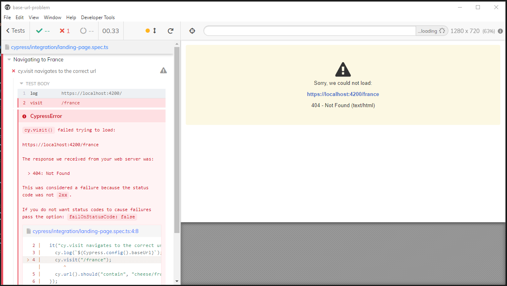

# BaseUrlProblem

This project was created to demonstrate an issue encountered using Cypress version 8.7.0. It would appear that if you are using @cypress/schematic, Cypress' official Angular schematic, the `baseUrl` option is ignored when a `devServerTarget` is specified.

## Development server

Run `ng serve` for a dev server. Navigate to `https://localhost:4200/`. The app will automatically redirect you to `/cheese`. This is the landing page of the app. Clicking on France or Germany will direct you to corresponding routes `/cheese/france` and `/cheese/germany`.

## Running E2E tests

There are multiple configurations as described in the `angular.json`. This is how each of the run configurations would theoretically work:

 - `npm run e2e` should run headed against a local dev server targetting a local backend
 - `npm run e2e:ci` should run headless against a local dev server targetting the backend (deployed in our dev environment)
 - `npm run e2e:regression` should run headless against the dev-deployed application & should also report
 - `npm run e2e:dev` should run headed against the dev-deployed application
 - `npm run e2e:local-local` should run headed against a local dev server targetting a local backend, but shouldn't spin it up... i.e. we would spin it up ourselves in a separate terminal
 - `npm run e2e:local-dev` should run headed against a local dev server targetting the backend (deployed in our dev environment)

Mind you, this is for demo purposes only so there is no actual backend to speak of. The reporter selected in the regression configuration is also a bogus reporter. So how are you supposed to reproduce the issue described? Glad you asked!

## Reproducing the issue

If you look at the `local-dev` configuration in the `angular.json` you will notice the `baseUrl` includes `/cheese`. Now run the test in `navigation.spec.ts`. The baseUrl that we `cy.log()` doesn't include `/cheese`. As a result, when we try to navigate to `/france` we get a 404 because `https://localhost:4200/france` does not exist.

## Workaround

Now there is a workaround, and that's to tell your app itself that the `deployUrl` for the `dev-proxy` config should be `/cheese`. This is probably good practice anyway. You can checkout the `workaround` branch to see this in action.

It would still be nice though for Cypress to use the `baseUrl` if you specify one.
